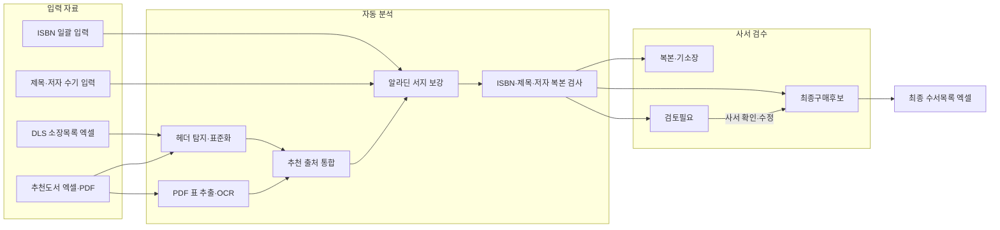

# SUSEORO · 수서로

**학교도서관 사서를 위한 수서 업무 자동화 프로그램**

> **수서로 v2 사용법:** [빠른 사용 설명서](docs/quick-start.md)
>
> 아래의 포터블 실행·회차 중심 설명은 기존 v1 배포본을 위한 내용이며, v2는 `로그인 → 내 수서 업무 → 수서 작업실`의 세 화면과 `후보 만들기 → 승인·발주 → 납품 검수`의 흐름으로 동작합니다.

SUSEORO는 DLS 소장목록과 여러 기관의 추천도서 자료를 한곳에 모아 정리하고,
복본 후보와 검토가 필요한 자료를 구분한 뒤 최종 수서목록 엑셀을 만드는 Windows용 로컬 도구입니다.

[](LICENSE)


[](https://github.com/sponsors/buildergarlic)

## 프로젝트가 해결하려는 문제

학교도서관 수서 업무에서는 DLS 소장목록, 기관별 추천 엑셀, PDF 목록, ISBN 메모처럼
형식이 서로 다른 자료를 반복해서 대조해야 합니다. SUSEORO는 이 자료들을 같은 기준으로 정리해
사서가 **판단 자체보다 판단해야 할 책에 집중**할 수 있도록 돕습니다.

- 여러 추천목록을 하나의 표준 형식으로 통합합니다.
- 같은 책이 여러 번 추천되면 추천 횟수와 출처를 함께 모읍니다.
- 기존 소장도서와 겹치는 복본 후보를 찾습니다.
- 정보가 불완전하거나 유사한 책은 자동 제외하지 않고 `검토필요`로 보냅니다.
- 마지막 선택과 수정은 사서가 직접 확정합니다.
- 검수 결과를 제출용 최종 수서목록 엑셀로 만듭니다.

## 한눈에 보는 처리 흐름



## 핵심 원칙

### 로컬 우선

프로그램은 `127.0.0.1`에서 실행되는 로컬 웹앱입니다. 학교별 원본 자료, 검수 상태,
최종 결과는 프로그램 폴더의 `workspace`에 저장됩니다.

### 사람의 최종 판단

ISBN 또는 정규화된 제목·저자가 확실히 일치하는 자료는 복본 후보로 분류하지만,
유사서명이나 OCR 품질이 낮은 자료는 자동으로 버리지 않습니다. `검토필요`에 남겨 사서가 확인합니다.

### 학교·회차별 누적

학교와 연도·회차를 기준으로 작업을 분리합니다. 이전 작업을 보존하면서 다음 수서 회차를 이어갈 수 있습니다.

## 지원하는 입력과 결과

| 구분 | 지원 내용 |
| --- | --- |
| 소장자료 | DLS 리스트 반출 엑셀 |
| 추천자료 | 여러 기관의 엑셀, 텍스트형 PDF, 스캔 PDF |
| 직접 입력 | ISBN 일괄 입력, `제목 \| 저자` 형식 입력 |
| 서지 보강 | 알라딘 Open API를 이용한 ISBN·제목 검색 |
| 중간 결과 | 통합검수결과 엑셀, 회차별 검수 상태 |
| 최종 결과 | 최종 수서목록 엑셀 |

PDF는 먼저 표 추출을 시도하며, 읽지 못하면 Tesseract OCR을 사용합니다.
알라딘 API 키가 없어도 목록 통합, 복본 검사, 수동 검수, 엑셀 출력은 사용할 수 있습니다.

## 빠른 시작

1. 배포 ZIP 파일을 PC의 바탕화면이나 문서 폴더에 압축 해제합니다.
2. 폴더 안의 `start.cmd`를 더블클릭합니다.
3. 브라우저가 열리지 않으면 `http://127.0.0.1:3847`에 접속합니다.
4. 학교 이름을 입력하고 학교 작업공간을 만듭니다.
5. 연도와 회차를 입력해 새 수서 회차를 만듭니다.
6. DLS 소장목록을 먼저 올리고 추천 엑셀·PDF 또는 수기 자료를 추가합니다.
7. `통합 분석 실행`을 누릅니다.
8. `최종구매후보`, `복본-기소장`, `검토필요`를 확인하고 필요한 행을 수정합니다.
9. `최종 수서목록 엑셀 생성`을 눌러 결과를 내려받습니다.
10. 작업을 마치려면 `stop.cmd`를 실행합니다.

> `SuseoroAI.exe`만 따로 옮기지 말고 압축을 푼 폴더 전체를 함께 사용하세요.

## 복본 검사 기준

| 우선순위 | 판별 기준 | 기본 처리 |
| --- | --- | --- |
| 1 | ISBN 일치 | `복본-기소장` |
| 2 | 제목 + 저자 정규화 일치 | `복본-기소장` |
| 3 | 제목·저자 유사도가 높음 | `검토필요-유사서명` |

같은 책이 여러 기관에서 추천되면 한 건으로 합치고 `추천건수`, `추천기관`, `추천파일`을 함께 보존합니다.

## 검수 화면에서 할 수 있는 일

- 최종 엑셀에 포함할 책을 선택하거나 제외합니다.
- 책의 상태를 `최종구매후보`, `검토필요`, `복본-기소장`으로 다시 분류합니다.
- 제목, 저자, 출판사, ISBN 등 잘못 읽힌 정보를 수정합니다.
- 제목과 저자를 기준으로 알라딘 서지를 다시 조회합니다.
- 조회된 후보 서지를 현재 행에 적용합니다.
- 검수 이력용 엑셀과 제출용 최종 엑셀을 각각 만듭니다.

최종 엑셀은 다음 열 순서를 유지합니다.

`NO.`, `도서명`, `지은이`, `출판사`, `ISBN`, `정가`, `쪽수`, `출판일`, `분류`, `목록출처`

## 데이터 보관 구조

```text
workspace/
└─ <학교명>/
   ├─ holdings/raw/                         # DLS 소장목록 원본
   ├─ recommendations/raw/                  # 추천도서 원본
   ├─ manual/manual_entries.xlsx            # 수기 입력
   ├─ catalog/catalog_master.xlsx           # 누적 서지 캐시
   └─ sessions/<연도-회차>/
      ├─ review_state.json                  # 검수 상태
      ├─ 통합검수결과.xlsx                   # 중간 결과
      └─ 최종수서목록.xlsx                   # 최종 제출용 파일
```

새 버전으로 교체할 때는 기존 `workspace` 폴더를 새 버전 폴더로 복사하면 작업을 이어갈 수 있습니다.
필요하면 개인 설정이 들어 있는 `config/settings.json`도 함께 옮기세요.

## 자세한 설명서

- [빠른 시작 1장 가이드](manual/quick-start.md)
- [상세 사용자 설명서](manual/detailed-user-guide.md)
- [설치 방법](manual/install-guide.md)
- [알라딘 API 키 설정](manual/aladin-api-guide.md)
- [강사용 15분 시연 순서](manual/instructor-script.md)
- [실습 샘플 안내](samples/README.md)

## 현재 상태

- Windows 포터블 배포본 v1.0
- 별도 설치 없이 폴더 단위로 실행
- 한국어·영어 OCR 지원
- 학교·연도·회차별 로컬 작업공간
- 복본 판별, 사람 검수, 최종 엑셀 출력 지원
- GitHub Sponsors 후원 경로 운영

현재 공개 저장소에는 포터블 실행본과 사용자 문서를 우선 제공하고 있습니다.
소스·빌드·배포 구조와 정식 GitHub Release 체계는 다음 개발 단계에서 정비할 예정입니다.

## 개발 우선순위

### 지금 · 안전과 유지보수

- 개인 API 키와 기타 비밀값을 저장소 및 공유 배포본에서 완전히 분리
- 공개 소스, 실행파일, AGPL-3.0 라이선스의 정합성 점검
- 재현 가능한 빌드와 기본 회귀 테스트 구축

### 다음 · 배포 체계

- 버전 태그, GitHub Release, 변경이력 도입
- 소스 코드와 Windows 배포파일 분리
- OCR 실행환경과 언어팩을 실제 사용 범위에 맞게 경량화
- 새 버전에서 기존 `workspace`를 안전하게 이전하는 절차 표준화

### 이후 · 제품 고도화

- 기관마다 다른 추천목록 형식에 대한 파싱 정확도 향상
- 대용량 엑셀 처리 속도와 도서 중복 판정 정밀도 개선
- 실제 학교도서관 파일럿과 회귀 테스트 데이터 축적
- 도서관 AX 교육, 기관 맞춤 세팅, 템플릿 라이선스와 연계

## 3개년 확장 방향

| 단계 | 목표 |
| --- | --- |
| 1차년도 | 도서관 AX 1일 과정과 수서로AI 실습 파일럿, 표준 실습파일·데모 영상 구축 |
| 2차년도 | 경남 지역 도서관·학교 대상 B2B/B2G 워크숍과 기관 맞춤형 세팅 정례화 |
| 3차년도 | 구독형·라이선스형 패키지, 온라인 교육 콘텐츠, 기업 AX 전환 패키지로 확장 |

수익모델은 개인 교육에서 시작해 도서관 워크숍, 기관별 세팅·교육,
실습 템플릿 라이선스, 기관 자동화 PoC 컨설팅으로 확장하는 구조를 지향합니다.

## 보안 안내

- 알라딘 API 키는 각 사용자가 발급받은 개인 키를 사용하세요.
- API 키를 GitHub, 공개 문서, 화면 캡처, 공유 ZIP에 포함하지 마세요.
- 키가 외부에 노출되었다면 기존 키를 즉시 폐기하고 새 키를 발급받으세요.
- 학교의 소장목록과 작업 결과가 포함된 `workspace` 폴더는 공개 저장소에 올리지 마세요.

## 후원

SUSEORO의 오류 수정, 문서 정비, 엑셀 파싱 속도와 정확도 향상,
도서 중복 판정 고도화와 안정적인 배포를 후원할 수 있습니다.

[GitHub Sponsors에서 SUSEORO 후원하기](https://github.com/sponsors/buildergarlic)

후원 여부와 관계없이 SUSEORO의 기본 오픈소스 기능은 계속 공개하는 것을 원칙으로 합니다.

## 라이선스

이 프로젝트는 [GNU Affero General Public License v3.0](LICENSE)을 따릅니다.
